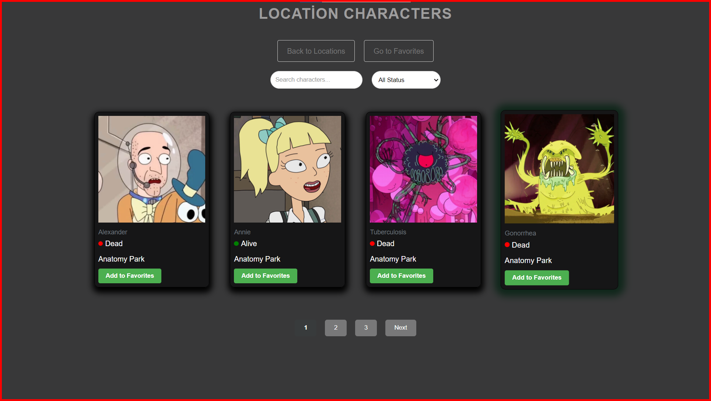

                                       # Rick and Morty Karakter Keşif Uygulaması

This project is a React application created to explore locations, characters, and their details within the Rick and Morty universe. Users can list different locations, filter characters within those locations based on their status, and view character details. Additionally, users can add or remove characters to/from "My Favorites" to create their personal favorite lists.

## Technologies:

ReactJS
Redux
TypeScript
SCSS
Rick and Morty API

                                 
